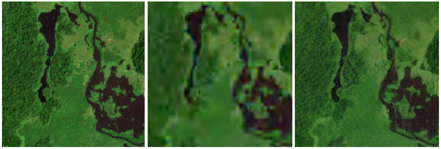

# HiFiC for Earth Observation Data
## Table of Contents
1. [Overview](#overview)
2. [Introduction](#introduction)
3. [Files](#notebook)
## Overview

HiFiC-EOD is a fork of Justin Tan's HiFiC PyTorch implementation. This project seeks to adapt HiFiC from its original RGB-centric framework to accommodate various data types, including those with more than 10 channels, each channel with its own precision and resolution.  
The ultimate goal is to achieve exceptionally high data compression rates while maintaining data integrity. The project is currently in an exploratory phase.

## Introduction

Earth Observation Data encompasses a wide range of data types.
These datasets often consist of high-resolution images and sensor data, posing significant challenges in terms of storage and transmission. 
HiFiC offers a solution by providing a very high compression while restored images are still understandable, without classical compression artifacts.

    
 <i>original vs jpeg2000 vs HiFiC (300 compression factor)</i>

## Files
[high-fidelity-generative-compression-master](high-fidelity-generative-compression-master)
contain the modified Justin Tan fork of HiFiC  

[jupyter_notebook](jupyter_notebook)
contain a use case of client decompression  

[VT_utilities](VT_utilities)
contain utilities for dataset download, image conversion, benshmarking...
